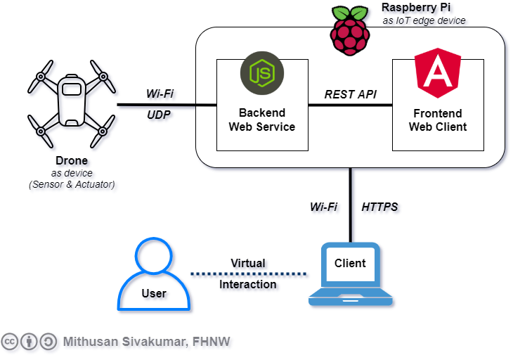
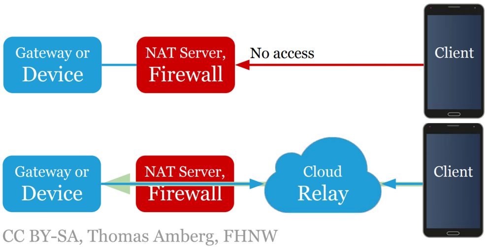
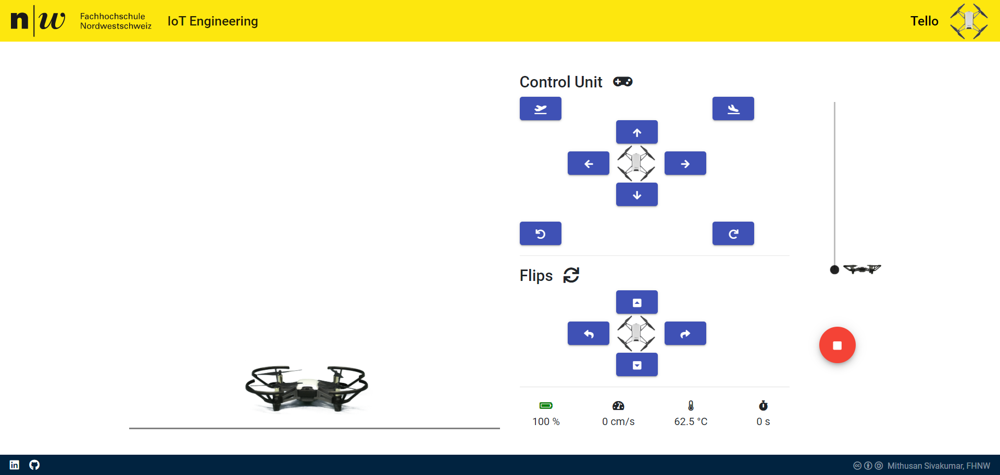

# IoT Engineering
## Project TELLO
<!--  -->

## Introduction
This project is part of the [IoT Engineering](../../../fhnw-iot) course at the [University of Applied Sciences and Arts Northwestern Switzerland](https://www.fhnw.ch/).\
*Mithusan Sivakumar* ([@sivakumm](https://github.com/sivakumm)) created and implemented this project in his own.

### Idea
The main idea is to create a Webpage, which allows to track movements and some additional data of a drone called [Tello](https://www.ryzerobotics.com/tello) by Ryze Tech. Moreover, the dashboard should include some control features to influce the drone.

### Required hardware
- Tello drone
- Raspberry Pi
- *optional:* WLan USB Adapter

In this case: A *[standard Tello Drone](https://www.ryzerobotics.com/tello)*, a *[Raspberry Pi 3 Model B](https://www.raspberrypi.org/products/raspberry-pi-3-model-b/)* and *[TP-Link TL-WN823N](https://www.amazon.com/-/de/dp/B0088TKTY2/ref=dp_cerb_2)* were used.

### Project design


The user interacts with a *Web Service* hosted on a Raspberry Pi with Node.js. This backend service redirects the user to an Angular frontend service. Communicaiton between frontend and backend is done by REST API calls. Data from and to the drone is sent by IPv4 UDP Socket. In this case, the Raspberry Pi works as an IoT Edge Device.

#### UDP Communication
An IPv4 UDP communication is used to transfer data between the drone and the Node.js backend service on the Raspberry Pi in both direction. The documentation [docs/Tello_SDK_Documentation.pdf](./docs/Tello_SDK_Documentation.pdf) contains all possible commands and response, which can be sent to the drone. Tello drone works like a WLan hotspot, where it has always the IP address `192.168.10.1`.

#### REST API Communication
```
Base URL: ./api/v1
```
> *Note: Since the frontend web page are compiled files integrated in the Node.js backend through the folder `static`, there's no need to enter a common URL or localhost. Instead, we can call the API from the current point.*

The web frontend makes an API request frequently to get almost live data of the drone's current state. The answer is passed by the Node.js backend web service.

```
GET     BASE_URL/currentStatus
```
Response on *success* in JSON format:
```json
{
    "status": 200,
    "statusText": "OK",
    "message": "delivery of current values",
    "data": {
        "pitch": 0,
        "roll": 0,
        "yaw": 0,
        "vgx": 0,
        "vgy": 0,
        "vgz": 0,
        "templ": 0,
        "temph": 0,
        "tof": 0,
        "h": 0,
        "bat": 0,
        "baro": 0,
        "time": 0,
        "agx": 0,
        "agy": 0,
        "agz": 0
    }
}
```
> *Note: Since there is no authentication, this request should not fail as long as the backend service is running. The zeros in `data` will be the current values from Tello.*

<br>
Through clicks on the blue buttons or using the height slider, commands can be sent to the drone.

```
POST     BASE_URL/command
```
Body:
```
command     The command you like to send to the drone
            String

value       The value to this command
            Integer
```
> *Note: Both body fields are mandatory. If the value is not necessary for a command e. g. flip, then just pass any Integer value (e. g. 0) which will be ignored.*

###### Available Commands
| command       | description                                                  |
| :------------ | :----------------------------------------------------------- |
| takeoff       | drone takes off                                              |
| land          | drone lands                                                  |
| forward       | fly forward given value in cm                                |
| back          | fly backward given value in cm                               |
| right         | fly right given value in cm                                  |
| left          | fly left given value in cm                                   |
| up            | fly up given value in cm - at least 20 cm                    |
| down          | fly down given value in cm - at least 20 cm                  |
| cw            | rotate clockwise by 90 degree                                |
| ccw           | rotate counter-clockwise by 90 degree                        |
| flip_forward  | drone makes a flip - forward direction                       |
| flip_backward | drone makes a flip - backward direction                      |
| flip_right    | drone makes a flip - right direction                         |
| flip_left     | drone makes a flip - left direction                          |
| emergency     | stops the motor immediately. **WARNING:** *Drone falls down* |


Response on *success* in JSON format:
```json
{
    "status": 202,
    "statusText": "Accepted",
    "message": "Received command successfully"
}
```
Response on *failure* if Tello didn't accept command in JSON format:
```json
{
    "status": 406,
    "statusText": "Not Acceptable",
    "message": "ERROR MESSAGE"
}
```
Response on *failure* on sending command to Tello in JSON format:
```json
{
    "status": 409,
    "statusText": "Conflict",
    "message": "ERROR MESSAGE"
}
```
> *Note: On response `406 - Not Acceptable` the error message often will be `error`, since the Tello drone doesn't deliver detailed error messages.*

<br>

## Source Code
###  Node.js backend
The complete source code of the backend service can be found in the folder [backend-nodejs](./backend-nodejs).\
In the folder *[static](./backend-nodejs/static/)* are the compiled angular frontend files. These files handles the complete webpage on the user side browser.

###  Angular frontend
The complete source code of the frontend service can be found in the folder [frontend-angular](./backend-angular).

<br>

## Presentation
A small 4 slides Presentation of this IoT project can be found in [presentation/Tello_Presentation.pdf](./presentation/Tello_Presentation.pdf).

<br>

## Further possible features
This project can be expanded, that you can access the web page from the internet. This can be done with NAT, but is not recommended. As shown below, a nicer and safer solution would be with a cloud relay e. g. [Ngrok](https://ngrok.com/), [Pagekite](https://pagekite.net/) or [Yaler](https://yaler.net/).

> **MAKE SURE** to add authentication features to the web page and API calls if you grant access from the internet. E. g. use [JSON Web Tokens](https://jwt.io/) to secure the page from unauthorized access.

<br>

## Run the project
### Step 1: Clone Repository
Start up your Raspberry Pi, open a terminal window and clone this project:
```
git clone https://github.com/fhnw-iot-5ibb1/fhnw-iot-project-tello.git
```

Change your directory to *backend-nodejs*:
```
$ cd backend-nodejs
```

### Step 2: Install/Create dependencies
You need to create two files `cert.pem` and `key.pem` for an encrypted HTTPS communication. This can be done like this:
```
$ openssl req -x509 -nodes -newkey rsa:2048 -keyout key.pem -out cert.pem -days 4096
```

If you don't have installed `node` and `npm` yet, follow the instruction on [https://www.instructables.com/id/Install-Nodejs-and-Npm-on-Raspberry-Pi/](https://www.instructables.com/id/Install-Nodejs-and-Npm-on-Raspberry-Pi/) to install it.

Install all node dependencies:
```
$ npm install
```

### Step 3: Connection to Drone
Make sure you are connected with your Tello Drone. 

#### 3.1 Working on the desktop environment
If you are on the desktop environment, simply connect to `TELLO-XXXXXX`.

#### 3.2 Working over SSH, but not connected over WLan 
If you are connected over ssh and raspberry pi has a not used wlan interface, then make the following steps.

Discover the SSID of your Tello drone. This can be done easily with another laptop or your mobile device. Afterwards, you need to add Tello to your network.
```
$ sudo nano /etc/wpa_supplicant/wpa_supplicant.conf
```

Append the following entry and replace `TELLO-XXXXXX` with your Tello SSID:
```
network={
    ssid="TELLO-XXXXXX"
    key_mgmt=NONE
}
```
Save file and exit nano with `CTRL + O` and `CTRL + X`.

Now restart your network with:
```
$ sudo service networking restart
```

#### 3.3 Connecting Tello over WLan USB Adapter
If you are using [TP-Link TL-WN823N](https://www.amazon.com/-/de/dp/B0088TKTY2/ref=dp_cerb_2), then install the dependencies:
```
$ sudo wget http://fars-robotics.net/install-wifi -O /usr/bin/install-wifi
$ sudo chmod +x /usr/bin/install-wifi
$ sudo install-wifi
```

And reboot your device.

Discover the SSID of your Tello drone. This can be done easily with another laptop or your mobile device. Afterwards, you need to add Tello to your network.
```
$ sudo cp /etc/wpa_supplicant/wpa_supplicant.conf /etc/wpa_supplicant/wpa_supplicant-wlan0.conf
$ sudo nano /etc/wpa_supplicant/wpa_supplicant-wlan1.conf
```

Append the following entry and replace `TELLO-XXXXXX` with your Tello SSID and `CH` with your country code.
```
ctrl_interface=DIR=/var/run/wpa_supplicant GROUP=netdev
update_config=1
country=CH

network={
        ssid="TELLO-XXXXXX"
        key_mgmt=NONE
}
```
Save file and exit nano with `CTRL + O` and `CTRL + X`.

Then edit `wpa_supplicant.conf` file:
```
$ sudo nano /etc/wpa_supplicant/wpa_supplicant.conf
```

Replace whole file with the following text. Make sure to replace `CH` with your own country code.
```
ctrl_interface=DIR=/var/run/wpa_supplicant GROUP=netdev
update_config=1
country=CH
```
Now reboot your device and it should connect to Tello via interface wlan1.

### Step 4: Start Webservice
Get to your project backend-nodejs folder
```
$ cd <DOWNLOADED_OR_CLONED_DIRECOTRY>/backend-nodejs
```

Start the Webservice
```
$ node WebService.js
```

### Step 5: Check result
If you are on your Raspberry Pi desktop, open the your chromium (web browser) and go to [https://localhost:4443](https://localhost:4443).

If you are in the same network as your Raspberry Pi, simply open your web browser (e. g. Google Chrome) and enter `https://YOUR_RASPBERRY_IP:4443`.

You should see this result:\


<br>

## Rights
 Mithusan Sivakumar, FHNW